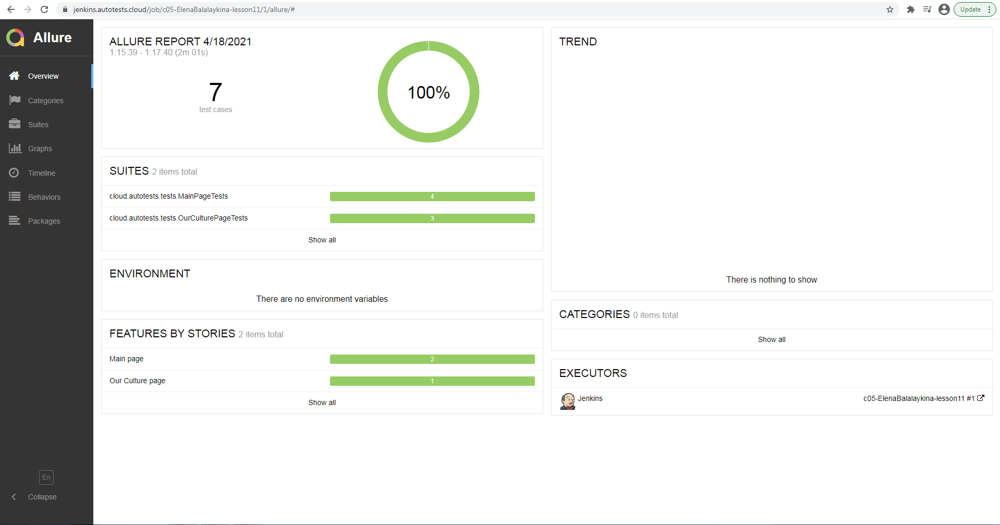
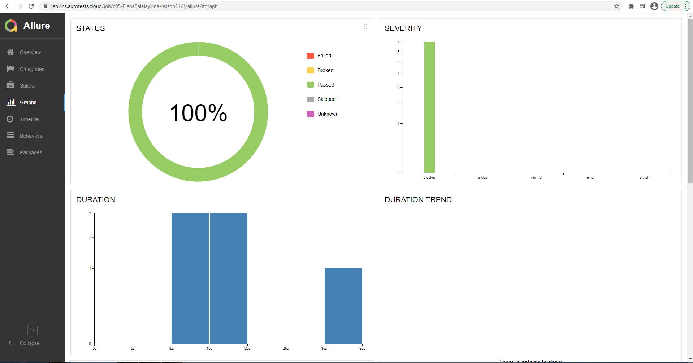
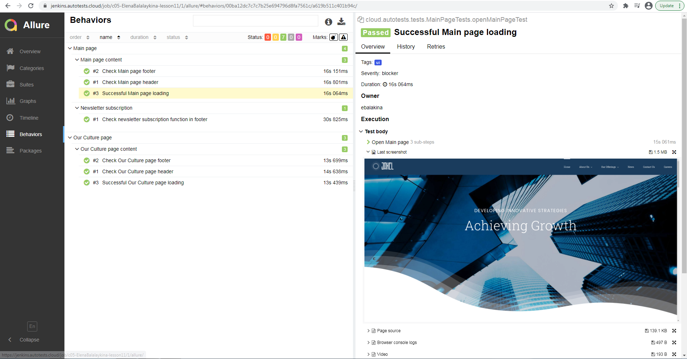
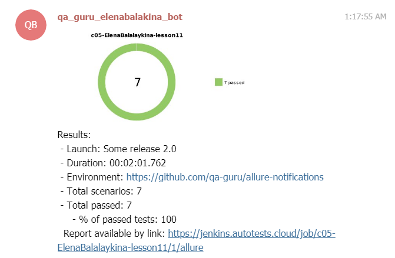

## UI automation testing for https://www.jaxel.com/

### Technology Stack
 

- Java
- Gradle
- Junit5
- Selenide
- Allure Report
- Jenkins
- Selenoid
- Telegram Bot

### Allure report

### Video

### Telegram notifications

### How to run autotests
To run autotests remotely pass the following parameters in remote_driver.properties:
- web.browser = { chrome, firefox, opera }
- web.browser.version = { 89.0, 88.0, 87.0, ...}
- web.browser.size = { 1920x1080, 1366x768, 1280x1024, 1280x800, 1024x768 }
- web.browser.mobile.view = { , iPhone X, iPad Pro, Nexus 7 }
- web.remote.driver.url = { your link to selenide or selenium grid }
- web.remote.driver.user = { your user name }
- web.remote.driver.password = {your password }
- video.storage = { your selenide video storage }

